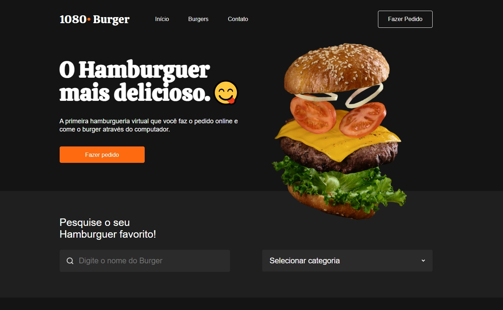

<h1 align="center"> Projeto 1080Burger </h1>

Projeto realizado no Curso B7Web para ensino de tecnologias WEB.
 
Veja ele aqui > https://zertel95.github.io/Projeto-1080Burger/

  <a href="#-tecnologias">Tecnologias</a>&nbsp;&nbsp;&nbsp;|&nbsp;&nbsp;&nbsp;
  <a href="#-projeto">Projeto</a>&nbsp;&nbsp;&nbsp;|&nbsp;&nbsp;&nbsp;
  <a href="#-layout">Layout</a>&nbsp;&nbsp;&nbsp;|&nbsp;&nbsp;&nbsp;
  <a href="#memo-licença">Licença</a>

  

 

## 🚀 Tecnologias

Esse projeto foi desenvolvido com as seguintes tecnologias:

- HTML 
- CSS

## 💻 Projeto

O 1080Burger é um projeto realizado no curso Full do B7Web..

## :memo: Licença

Esse projeto está sob a licença MIT.

---

Feito com ♥ by Cássio Machado.
